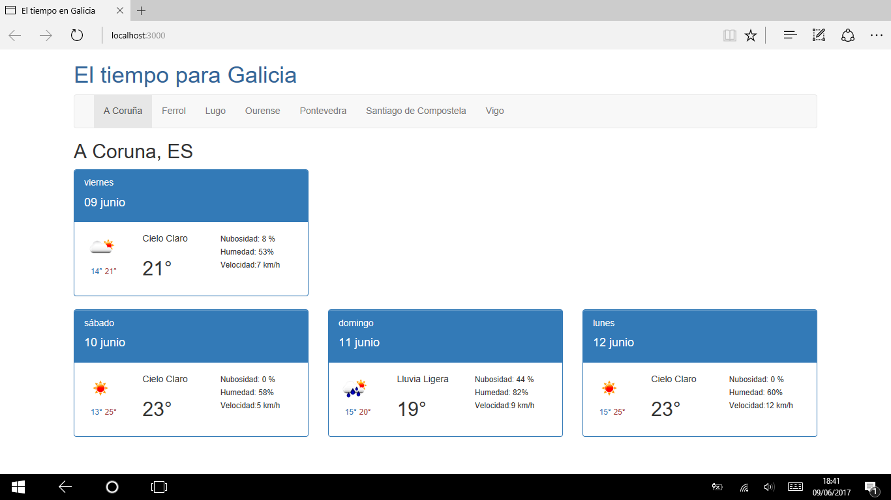

# weatherGalicia
El tiempo en Galicia es una pequeña aplicación web en Angular 2 que consume los servicios disponibles de http://openweathermap.org y que representa la evolución de los principales parámetros meteorológicos (humedad, temperatura, etc) en los siguientes 4 días en las capitales de provincia gallegas.




## Instalación
Clonar el repositorio e instalar las dependencias
```
$ git clone https://github.com/pmtilve/weatherGalicia.git

$ cd weatherGalicia

$ npm install

$ npm start
```

